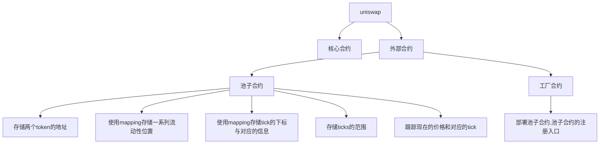

### 流动性（liquidity）

交易能够正常进行的保障是*流动性*(liquity),即是整个市场中所有可用资产的数目。假设你希望买一个《塞尔达.国王之泪》的卡带但是没有人售卖，即是没有流动性；如果你希望卖出一个该卡带，但是没有人购买，即为市场有流动性但是没有买方。

> 我以前对流动性概念的理解有偏差；以为有交易发生就是有流动性。

### 做市商（market maker）

如果市场缺乏流动性，但是交易者仍然希望进行交易，那么就需要做市商。做市商是向市场提供流动性的、拥有大量各种资产的公司或个人。**通过提供流动性，做市商能够从交易中获取利润。**

### 自动化做市商AMM

一个AMM是一套定义如何管理流动性的智能合约。每个单独的交易对（例如ETH/USDC）都是一个单独的智能合约，它存储了ETH和USDC的资产并且撮合交易。在这个合约中，我们可以将ETH兑换成USDC或者将USDC兑换成ETH。

在 AMM 中，一个核心概念为**池子(pooling)**：每个合约都是一个存储流动性的*池子*，允许不同的用户（包括其他合约）在其中进行某种方式的交易。**AMM 中有两种角色，流动性提供者(LP)以及交易者(trader)**；这两方通过流动性池进行交互，而交互的方式由合约进行规定且不可更改。


这种交易方法与 CEX 的关键区别在于： 智能合约是完全自动化并且不受任何人控制的。没有经理，没有系统管理员，没有特权用户，一切都没有。这里只有 LP 和交易者，任何人都可以担任这两种角色（也可以同时），并且所有的算法都是公开的、程序规定的、不可更改的。

> 注意：*pool*和*pair*两个词可能会被交替使用，因为一个 Uniswap 的流动性池即一对 token。

### 恒定函数做市商（CFMM）

$$
x*y=k
$$

当用户进行交易，他们通常将一种类型的token放入池子（也即他们打算卖出的token），并且将另一种类型的token移出池子（也即打算购买的token）。这笔交易会改变池子中两种资产的数量，而上述原理表示，两种资产数目的**乘积**必须保持不变。我们之后还会在本书中看到许多次这个原理，这就是 Uniswap 的核心机制。

> 一开始，我很不理解，明明是用一种代币换另外一种代币的交换游戏；为什么还算购入token、卖出token。现在，我悟了：现实生活中的买同样也是使用一种物品换另外一种物品。(只不过，钱是公认的物品而已。)

### 交易函数

交易发生时的公式：
$$
(x+rΔx)(y-Δy)=xy
$$

- r表示这个池子收取一定数量的手续费

### 价格

在现实世界中，价格是根据供求关系来决定的，对于AMM当然也是如此，现在，我们先不考虑需求方，**只关注供给方**。

池子中的token的价格是由token的供给量决定的，即池子中拥有该token的资产数目，token的价格公式如下：
$$
P_x=\frac yx ,P_y =\frac xy
$$
其中  P<sub>x</sub> 和  P<sub>y</sub>  是一个token相对于另一个token的价格

> 这个价格里，就反应了物以稀为贵的道理；y的数量相对于x越多，y越不值钱。

这个价格被称为现货价格/现价，它反映了当前的市场价。然而，交易i实际成交的价格却并不是这个价格。现在我们再重新把需求方纳入考虑：

根据供求关系，**需求越高，价格也越高**，这也是我们应当在去中心化交易中满足的性质。我们希望当需求很高的时候价格会升高，并且我们能够用池子里的资产数量来衡量需求：你希望从池子中获取某个token的数量越多，价格变动就越剧烈。我们再重新考虑上面这个公式：
$$
(x+rΔx)(y-Δy)=k
$$
从这个公式中，我们能够推导出关于Δx和Δy的式子，这也意味着：**我们能够通过交易花费的token0的数量来计算出获得的token1的数目**
$$
Δy=\frac{yrΔx}{x+rΔx},
Δx=\frac{xΔy}{r(y-Δy)}
$$

### 曲线


横纵坐标分别表示池子中两种代币的数量，每一笔交易的起始点都是在曲线上与当前两种代币比例相对应的点。为了计算交易获得的token数量，我们需要找到曲线上的一个新的点，其横坐标为x+Δx，也即池子中现在token0的数量加上我们卖出的数量，y轴的变化量就是我们将会获得的token1的数量。

> 从图中，我们可以侧面印证上述公式推导的观点。由于给定任意一个x，有且仅有唯一的y与之对应；给定一个y，也同样有且仅有唯一一个y与之对应。因此，我们已知x+rΔx、y，自然有办法求出Δy

尽管Uniswap不计算交易价格，我们仍然能够从曲线上看到它。在一笔交易中我们有很多个价格：

1. 在交易前，有一个现货价格。这个价格等于池子中两种资产的比例，y/x 或x/y。取决于交易的方向，这个价格也是起始点切线的斜率。
2. 在交易后，有一个新的现货价格，在曲线上另一个不同的点。这个价格是新的点的切线斜率。
3. 这个交易的实际发生价格，**是连接新旧点的这条线的斜率**。

### 集中流动性

V3引入了集中流动性的概念：LP可以选择他们希望在哪个价格区间提供流动性。这个机制通过将更多的流动性提供在一个相对狭窄的价格区间，来大大提高资产利用效率。

简单地来说，一个 Uniswap V3 的交易对由许多个 Uniswap V2 的交易对构成。V2 与 V3 的区别是，在 V3 中，一个交易对有许多的**价格区间**，而每个价格区间内都有**一定数量的资产**。从零到正无穷的整个价格区间被划分成了许多个小的价格区间，每一个区间中都有一定数量的流动性。而更关键的点在于，在每个小的价格区间中，**工作机制与 Uniswap V2** 完全一样。这也是为什么我们说一个 Uniswap V3 的池子就是许多个 V2 的池子。

### V3 的数学原理

V3在V2的基础上做了一点改进。

为了处理价格区间之间的转换，简化流动性管理，以及避免取整出现问题，V3使用了下面这些新标识：
$$
L =\sqrt{xy}, \sqrt p=\sqrt{\frac yx}
$$
L被称作流动性数量，池子中的流动性是两种token资产数量的组合。按照公式，两种代币数量的乘积为K，因此我们可以用$\sqrt xy$来衡量池子流动性。

y/x是token0相对于token1的价格。由于池子里两种代币价格互为倒数，我们在计算中仅使用其中一个。

我们使用$\sqrt p$而不是p有两个原因：

1. 平方根计算并不精确并且回引入取整的问题。因此，更简单的方法是我们干脆就在合约中存平方根的结果，而不是在合约中计算它。

2. $\sqrt p$ 与 L之间有一个有趣的关系：L也表示输出数量的变化与$\sqrt p$的变化之间的关系：
   $$
   L = \frac{\bigtriangleup y}{\bigtriangleup \sqrt p}
   $$
   L和$\sqrt p$ 让我们不再需要存储和更新池子资产数量。并且，我们也并不需要每次都重新计算$\sqrt p$ 因为我们从上述公式可以得到$\bigtriangleup \sqrt p$.

### Ticks

正如前面所说，V2中无穷价格区间在V3中被分为更小的价格区间，每个区间都由上下界端点进行限制。为了进行这些边界的协调，V3引入了ticks。


在V3，整个价格区间由离散的、均匀分布的ticks进行标定。每个tick有一个index和对应的价格：
$$
p(i) = 1.0001^i
$$
使用1.0001的幂次有很好的性质：
$$
1.0001^5=1.0005 , 1.0001^4=1.0004
$$
两个相邻tick之间的差距为0.01%或者一个基点。

> 基点是金融中用来衡量百分比的一个单位：1%的百分之一。在央行宣布对利率调整中经常出现基点整个名词。

Uniswap V3存储的是 $\sqrt p$ 而不是P。所以这个公式实际上是：
$$
\sqrt {p(i)} = \sqrt {1.0001^i} = 1.0001 ^{\frac i2}
$$
我们得到的价大概是这样的：$\sqrt {p(0)}=1$,$\sqrt {p(1)}=\sqrt {1.0001}≈ 1.00005$,$\sqrt {p(-1)}≈0.99995$  

Ticks可以为正也可以为负，并且显然它不是无穷的。V3把$\sqrt p$ 存储为一个Q64.96类型的定点数，使用64位作为整数部分，使用96位作为小数部分。因此，价格的取值范围[$2^{-128}$,$2^{128}$] ,经过计算ticks的取值范围[-887272,887272]。

### 池子合约

Uniswap的所有合约被分为两类：

- 核心合约（core contracts）
- 外部合约（periphery contracts）

这些合约是最小的，对用户不友好的，底层合约，在uniswap V3中，核心合约包含以下两种：

- 池子合约（pool），实现了去中心化交易的核心逻辑
- 工厂合约（Factory）作为池子合约的注册入口，使得部署池子合约变得更加简单。

从池子合约开始，这部分实现了uniswap **99%的核心功能**。

创建`src/UniswapV3Pool.sol`

```solidity
pragma solidity ^0.8.14;

contract UniswapV3Pool{}
```

让我们想一下这个合约需要存储哪些数据：

1. 由于每个合约都是一对 token 的交易市场，我们需要存储两个 token 的地址。这些地址是静态的，仅设置一次并且保持不变的(因此，这些变量需要被设置为 immutable)；
2. 每个池子合约包含了一系列的流动性位置，我们需要用一个 mapping 来存储这些信息，key 代表不同位置，value 是包含这些位置相关的信息；

> 我的理解是，用户可以在一个池子的大区间中选择自己有意愿的小区间；这些小区间就是position。

​	3.每个池子合约都包含一些 tick 的信息，需要一个 mapping 来存储 tick 的下标与对应的信息；

> 具体是对应哪些信息呢？
>
> 答：存储这个tick是否初始化、流动性的数量有多少

​	4.tick 的范围是固定的，这些范围在合约中存为常数；

> 前面讲过$\sqrt p$是存储在Q64.94类型中的，因此范围是固定的；另外每个池中的价格的取值范围也是固定的，因此范围也是固定的；
>
> 此处指的是哪个范围呢?
>
> 答：是前者

​	5.需要存储池子流动性的数量 *L*；

​	6.最后，我们还需要跟踪现在的价格和对应的 tick。我们将会把他们存储在一个 slot 中来节省 gas 费：因为这些变量会被频繁读写，所以我们需要充分考虑 [Solidity 变量在存储中的分布特点](https://docs.soliditylang.org/en/v0.8.17/internals/layout_in_storage.html)




总之，合约大概存储了以下这些信息：

```solidity
// src/lib/Tick.sol
library Tick {
    struct Info {
        bool initialized;
        uint128 liquidity;
    }
    ...
}

// src/lib/Position.sol
library Position {
    struct Info {
        uint128 liquidity;
    }
    ...
}

// src/UniswapV3Pool.sol
contract UniswapV3Pool {
    using Tick for mapping(int24 => Tick.Info);//使用Tick这个库作用于后面这个mapping类型
    using Position for mapping(bytes32 => Position.Info);
    using Position for Position.Info;
	
	//存储tick的范围
    int24 internal constant MIN_TICK = -887272;
    int24 internal constant MAX_TICK = -MIN_TICK;

    //存储两个token的地址
    address public immutable token0;
    address public immutable token1;

    // 存储当前的价格、对应的tick
    struct Slot0 {
        // Current sqrt(P)
        uint160 sqrtPriceX96;
        // Current tick
        int24 tick;
    }
    Slot0 public slot0;

    // 存储流动性
    uint128 public liquidity;

    // Ticks info———》跟踪现在的价格和对应的tick
    mapping(int24 => Tick.Info) public ticks;
    // Positions info————》
    mapping(bytes32 => Position.Info) public positions;

    ...
```

using A for B 是solidity的一个语言特性，能够让你用库合约A中的函数来扩展类型B。

接下来，我们在constructor中初始化其中一些变量：

```solidity
    constructor(
        address token0_,
        address token1_,
        uint160 sqrtPriceX96,
        int24 tick
    ) {
        token0 = token0_;
        token1 = token1_;

        slot0 = Slot0({sqrtPriceX96: sqrtPriceX96, tick: tick});
    }
```

在构造函数中，我们初始化了不可变的token地址，现在的价格和对应的tick。我们暂时还不需要提供流动性。

### 铸造

在UniswapV2中，提供流动性被称作铸造(mint),因为Uniswap V2的池子给予LP-token 作为提供流动性的交换，V3没有这种行为，但是仍保留了同样的名字

```solidity
function mint(
	address owner,
	int24 lowerTick,
	int24 upperTick,
	uint128 amount
)external returns (uint256 amount0, uint256 amount1){
	...
	
}
```

我们的mint函数会包含以下参数：

1. token所有者的地址，来识别是谁提供流动性
2. 上届和下界的tick，来设置价格区间的边界
3. 希望提供流动性的数量

> 注意到在这里，用户指定了 *L*，而不是具体的 token 数量。这显然不是特别方便，但是要记得池子合约是核心合约的一部分——它并不需要用户友好，因为它仅实现了最小的核心逻辑。在后面章节中，我们会实现一些辅助合约，来帮助用户在调用 `Pool.mint` 前将token数目转换成 *L*。

我们简单描述一下铸造函数如何工作：

1. 用户指定价格区间和流动性数量；
2. 合约更新ticks和positions的mapping；

> 更新了哪些信息呢？

1. 合约计算出用户需要提供的token数量（在本节我们用事先计算好的值）；
2. 合约从用户处获得token，并且验证数量是否正确。

首先来检查ticks：

- 检查用户输入的tick下界是不是离谱的超过了上届
- 用户的下界不能低于最低标准
- 用户的上界不能高于最高标准

```solidity
if (
    lowerTick >= upperTick ||
    lowerTick < MIN_TICK ||
    upperTick > MAX_TICK
) revert InvalidTickRange();
```

> 用户可以在池子合约指定的tick范围内，选择一个自己满意的tick

并且确保流动性的数量不为零：

```solidity
if (amount == 0) revert ZeroLiquidity();
```

接下来，增加tick和position的信息：

```solidity
ticks.update(lowerTick, amount);
ticks.update(upperTick, amount);

Position.Info storage position = positions.get(
    owner,
    lowerTick,
    upperTick
);
position.update(amount);
```

`ticks.update`函数如下

```solidity
// src/lib/Tick.sol
function update(
    mapping(int24 => Tick.Info) storage self,
    int24 tick,
    uint128 liquidityDelta
) internal {
    Tick.Info storage tickInfo = self[tick];
    uint128 liquidityBefore = tickInfo.liquidity;
    uint128 liquidityAfter = liquidityBefore + liquidityDelta;

    if (liquidityBefore == 0) {
        tickInfo.initialized = true;
    }

    tickInfo.liquidity = liquidityAfter;
}
```

它初始化一个流动性为 0 的 tick，并且在上面添加新的流动性。正如上面所示，我们会在下界 tick 和上界 tick 处均调用此函数，流动性在两边都有添加。

```solidity
// src/libs/Position.sol
function update(Info storage self, uint128 liquidityDelta) internal {
    uint128 liquidityBefore = self.liquidity;
    uint128 liquidityAfter = liquidityBefore + liquidityDelta;

    self.liquidity = liquidityAfter;
}
```

与tick函数类似，它也在特定的位置上添加流动性，其中get函数如下：

```solidity
// src/libs/Position.sol
...
function get(
    mapping(bytes32 => Info) storage self,
    address owner,
    int24 lowerTick,
    int24 upperTick
) internal view returns (Position.Info storage position) {
    position = self[
        keccak256(abi.encodePacked(owner, lowerTick, upperTick))
    ];
}
...
```

每个位置都由三个变量所确定：LP 地址，下界 tick 下标，上界 tick 下标。我们将这三个变量哈希来减少数据存储开销：哈希结果只有 32 字节，而三个变量分别存储需要 96 字节。

> 如果我们使用三个变量来标定，我们就需要三个 mapping。每个变量都分别需要 32 字节的开销，因为 solidity 会把变量存储在 32 字节的 slot 中（此处没有 packing）

> 现在理解：position记录的是当前的流动性呀、以及各个LP选择的区间呀这些信息

让我们继续完成我们的 mint 函数。接下来我们需要计算用户需要质押 token 的数量，幸运的是，我们在上一章中已经用公式计算出了对应的数值。在这里我们会在代码中硬编码这些数据：

```solidity
amount0 = 0.998976618347425280 ether;
amount1 = 5000 ether;
```

现在，我们可以从用户处获得 token 了。这部分是通过 callback 来实现的：

```solidity
uint256 balance0Before;
uint256 balance1Before;
if (amount0 > 0) balance0Before = balance0();
if (amount1 > 0) balance1Before = balance1();
IUniswapV3MintCallback(msg.sender).uniswapV3MintCallback(
    amount0,
    amount1
);
if (amount0 > 0 && balance0Before + amount0 > balance0())
    revert InsufficientInputAmount();
if (amount1 > 0 && balance1Before + amount1 > balance1())
    revert InsufficientInputAmount();
```

